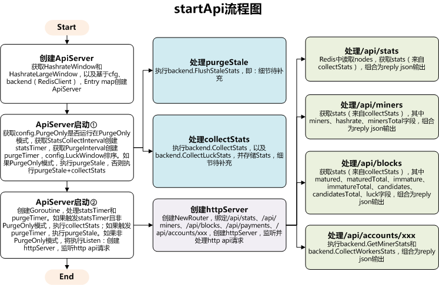

# open-ethereum-pool以太坊矿池-api模块

## ApiServer相关定义

```go
type ApiConfig struct {
        Enabled              bool   `json:"enabled"`
        Listen               string `json:"listen"`
        StatsCollectInterval string `json:"statsCollectInterval"`
        HashrateWindow       string `json:"hashrateWindow"`
        HashrateLargeWindow  string `json:"hashrateLargeWindow"`
        LuckWindow           []int  `json:"luckWindow"`
        Payments             int64  `json:"payments"`
        Blocks               int64  `json:"blocks"`
        PurgeOnly            bool   `json:"purgeOnly"`
        PurgeInterval        string `json:"purgeInterval"`
}

type ApiServer struct {
        config              *ApiConfig
        backend             *storage.RedisClient
        hashrateWindow      time.Duration
        hashrateLargeWindow time.Duration
        stats               atomic.Value
        miners              map[string]*Entry
        minersMu            sync.RWMutex
        statsIntv           time.Duration
}

type Entry struct {
        stats     map[string]interface{}
        updatedAt int64
}
//代码位置api/server.go
```

## startApi流程图



## CollectStats原理

```go
//调取：stats, err := s.backend.CollectStats(s.hashrateWindow, s.config.Blocks, s.config.Payments)
//s.hashrateWindow即cfg.HashrateWindow，即：为每个矿工估计算力的快速时间间隔，30分钟
//s.config.Blocks即：前端显示的最大块数，50个
//s.config.Payments即：前端显示的最大付款数量，50个
func (r *RedisClient) CollectStats(smallWindow time.Duration, maxBlocks, maxPayments int64) (map[string]interface{}, error) {
	//换算成秒
	window := int64(smallWindow / time.Second)
	//创建map
	stats := make(map[string]interface{})

	//Redis事务块
	tx := r.client.Multi()
	defer tx.Close()

	now := util.MakeTimestamp() / 1000

	cmds, err := tx.Exec(func() error {
		tx.ZRemRangeByScore(r.formatKey("hashrate"), "-inf", fmt.Sprint("(", now-window))
		tx.ZRangeWithScores(r.formatKey("hashrate"), 0, -1)
		tx.HGetAllMap(r.formatKey("stats"))
		tx.ZRevRangeWithScores(r.formatKey("blocks", "candidates"), 0, -1)
		tx.ZRevRangeWithScores(r.formatKey("blocks", "immature"), 0, -1)
		tx.ZRevRangeWithScores(r.formatKey("blocks", "matured"), 0, maxBlocks-1)
		tx.ZCard(r.formatKey("blocks", "candidates"))
		tx.ZCard(r.formatKey("blocks", "immature"))
		tx.ZCard(r.formatKey("blocks", "matured"))
		tx.ZCard(r.formatKey("payments", "all"))
		tx.ZRevRangeWithScores(r.formatKey("payments", "all"), 0, maxPayments-1)
		return nil
	})

	if err != nil {
		return nil, err
	}

	result, _ := cmds[2].(*redis.StringStringMapCmd).Result()
	stats["stats"] = convertStringMap(result)
	candidates := convertCandidateResults(cmds[3].(*redis.ZSliceCmd))
	stats["candidates"] = candidates
	stats["candidatesTotal"] = cmds[6].(*redis.IntCmd).Val()

	immature := convertBlockResults(cmds[4].(*redis.ZSliceCmd))
	stats["immature"] = immature
	stats["immatureTotal"] = cmds[7].(*redis.IntCmd).Val()

	matured := convertBlockResults(cmds[5].(*redis.ZSliceCmd))
	stats["matured"] = matured
	stats["maturedTotal"] = cmds[8].(*redis.IntCmd).Val()

	payments := convertPaymentsResults(cmds[10].(*redis.ZSliceCmd))
	stats["payments"] = payments
	stats["paymentsTotal"] = cmds[9].(*redis.IntCmd).Val()

	totalHashrate, miners := convertMinersStats(window, cmds[1].(*redis.ZSliceCmd))
	stats["miners"] = miners
	stats["minersTotal"] = len(miners)
	stats["hashrate"] = totalHashrate
	return stats, nil
}
```


