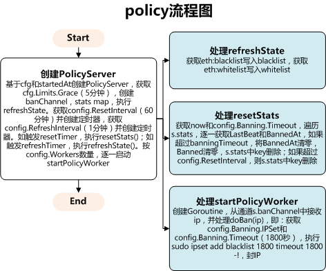

# open-ethereum-pool以太坊矿池-policy模块

## PolicyServer定义

```go
type PolicyServer struct {
	sync.RWMutex
	statsMu    sync.Mutex
	config     *Config
	stats      map[string]*Stats
	banChannel chan string
	startedAt  int64
	grace      int64
	timeout    int64
	blacklist  []string
	whitelist  []string
	storage    *storage.RedisClient
}
```

## policy流程图



## GetBlacklist和GetWhitelist

```go
// Always returns list of addresses. If Redis fails it will return empty list.
func (r *RedisClient) GetBlacklist() ([]string, error) {
	//SMEMBERS eth:blacklist
	//Smembers 命令返回集合中的所有的成员
	cmd := r.client.SMembers(r.formatKey("blacklist"))
	if cmd.Err() != nil {
		return []string{}, cmd.Err()
	}
	return cmd.Val(), nil
}

// Always returns list of IPs. If Redis fails it will return empty list.
func (r *RedisClient) GetWhitelist() ([]string, error) {
	//SMEMBERS eth:whitelist
	//Smembers 命令返回集合中的所有的成员
	cmd := r.client.SMembers(r.formatKey("whitelist"))
	if cmd.Err() != nil {
		return []string{}, cmd.Err()
	}
	return cmd.Val(), nil
}
```

## IsBanned

```go
func (s *PolicyServer) IsBanned(ip string) bool {
	x := s.Get(ip)
	return atomic.LoadInt32(&x.Banned) > 0
}

func (s *PolicyServer) Get(ip string) *Stats {
	s.statsMu.Lock()
	defer s.statsMu.Unlock()

	if x, ok := s.stats[ip]; !ok {
		x = s.NewStats()
		s.stats[ip] = x
		return x
	} else {
		x.heartbeat()
		return x
	}
}

func (s *PolicyServer) NewStats() *Stats {
	x := &Stats{
		ConnLimit: s.config.Limits.Limit,
	}
	x.heartbeat()
	return x
}
```

## 处理ApplyMalformedPolicy

```go
//应用格式错误的策略
//malformedLimit为5次
func (s *PolicyServer) ApplyMalformedPolicy(ip string) bool {
	x := s.Get(ip)
	n := x.incrMalformed()
	if n >= s.config.Banning.MalformedLimit {
		s.forceBan(x, ip)
		return false
	}
	return true
}

func (x *Stats) incrMalformed() int32 {
	return atomic.AddInt32(&x.Malformed, 1)
}

func (s *PolicyServer) forceBan(x *Stats, ip string) {
	//没启用Banning或在白名单
	if !s.config.Banning.Enabled || s.InWhiteList(ip) {
		return
	}
	atomic.StoreInt64(&x.BannedAt, util.MakeTimestamp())

	//x.Banned赋值为1
	if atomic.CompareAndSwapInt32(&x.Banned, 0, 1) {
		//"ipset": "blacklist",
		if len(s.config.Banning.IPSet) > 0 {
			s.banChannel <- ip
		} else {
			log.Println("Banned peer", ip)
		}
	}
}
```

## 处理ApplyLoginPolicy

```go
func (s *PolicyServer) ApplyLoginPolicy(addy, ip string) bool {
	if s.InBlackList(addy) {
		x := s.Get(ip)
		s.forceBan(x, ip)
		return false
	}
	return true
}

func (s *PolicyServer) InBlackList(addy string) bool {
	s.RLock()
	defer s.RUnlock()
	return util.StringInSlice(addy, s.blacklist)
}
```

## 处理ApplyLoginPolicy

```go
func (s *PolicyServer) ApplySharePolicy(ip string, validShare bool) bool {
	x := s.Get(ip)
	x.Lock()

	if validShare {
		x.ValidShares++
		if s.config.Limits.Enabled {
			//Increase allowed number of connections on each valid share
			//每个有效share可以增加的连接数
			//"limitJump": 10
			x.incrLimit(s.config.Limits.LimitJump)
		}
	} else {
		x.InvalidShares++
	}

	totalShares := x.ValidShares + x.InvalidShares
	//Check after after miner submitted this number of shares
	//30个shares后检查
	//"checkThreshold": 30,
	if totalShares < s.config.Banning.CheckThreshold {
		x.Unlock()
		return true
	}
	validShares := float32(x.ValidShares)
	invalidShares := float32(x.InvalidShares)
	x.resetShares()
	x.Unlock()

	//无效share比例
	ratio := invalidShares / validShares

	// Percent of invalid shares from all shares to ban miner
	//"invalidPercent": 30,
	if ratio >= s.config.Banning.InvalidPercent/100.0 {
		s.forceBan(x, ip)
		return false
	}
	return true
}

//加
func (x *Stats) incrLimit(n int32) {
	atomic.AddInt32(&x.ConnLimit, n)
}

//reset
func (x *Stats) resetShares() {
	x.ValidShares = 0
	x.InvalidShares = 0
}
```

## 处理ApplyLimitPolicy

```go
func (s *PolicyServer) ApplyLimitPolicy(ip string) bool {
	if !s.config.Limits.Enabled {
		return true
	}
	now := util.MakeTimestamp()
	//"grace": "5m",
	if now-s.startedAt > s.grace {
		//减1
		return s.Get(ip).decrLimit() > 0
	}
	return true
}

func (x *Stats) decrLimit() int32 {
        return atomic.AddInt32(&x.ConnLimit, -1)
}
```

## 处理BanClient

```go
func (s *PolicyServer) BanClient(ip string) {
	x := s.Get(ip)
	s.forceBan(x, ip)
}
```