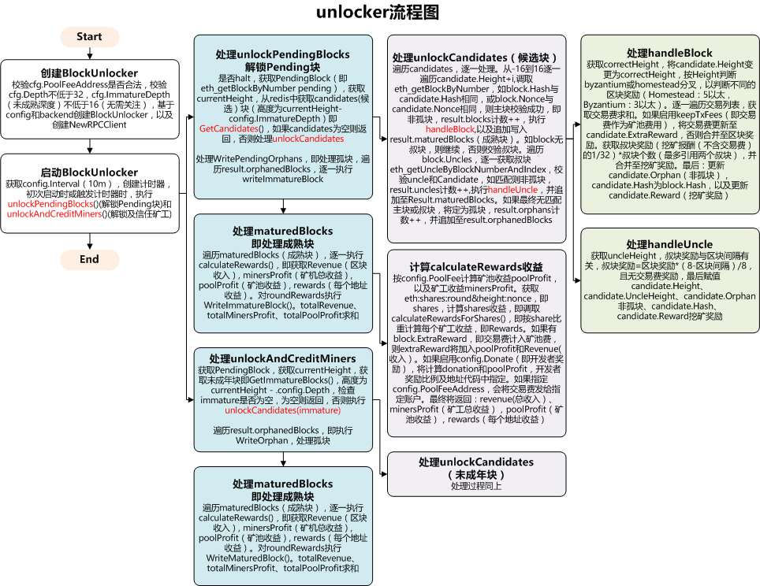

# open-ethereum-pool以太坊矿池-unlocker模块

## unlocker模块配置

```json
"unlocker": {
	"enabled": false,
	"poolFee": 1.0,
	"poolFeeAddress": "",
	"donate": true,
	"depth": 120,
	"immatureDepth": 20,
	"keepTxFees": false,
	"interval": "10m",
	"daemon": "http://127.0.0.1:8545",
	"timeout": "10s"
},
```

## BlockUnlocker定义

```go
type BlockUnlocker struct {
	config   *UnlockerConfig
	backend  *storage.RedisClient
	rpc      *rpc.RPCClient
	halt     bool
	lastFail error
}
```

## unlocker流程图



## GetCandidates原理

```go
func (r *RedisClient) GetCandidates(maxHeight int64) ([]*BlockData, error) {
	//ZRANGEBYSCORE eth:blocks:candidates 0 maxHeight WITHSCORES
	option := redis.ZRangeByScore{Min: "0", Max: strconv.FormatInt(maxHeight, 10)}
	cmd := r.client.ZRangeByScoreWithScores(r.formatKey("blocks", "candidates"), option)
	if cmd.Err() != nil {
		return nil, cmd.Err()
	}
	return convertCandidateResults(cmd), nil
}

func convertCandidateResults(raw *redis.ZSliceCmd) []*BlockData {
	var result []*BlockData
	for _, v := range raw.Val() {
		// "nonce:powHash:mixDigest:timestamp:diff:totalShares"
		block := BlockData{}
		block.Height = int64(v.Score)
		block.RoundHeight = block.Height
		fields := strings.Split(v.Member.(string), ":")
		block.Nonce = fields[0]
		block.PowHash = fields[1]
		block.MixDigest = fields[2]
		block.Timestamp, _ = strconv.ParseInt(fields[3], 10, 64)
		block.Difficulty, _ = strconv.ParseInt(fields[4], 10, 64)
		block.TotalShares, _ = strconv.ParseInt(fields[5], 10, 64)
		block.candidateKey = v.Member.(string)
		result = append(result, &block)
	}
	return result
}
```

## writeImmatureBlock原理

```go
//Immature即未成年
func (r *RedisClient) writeImmatureBlock(tx *redis.Multi, block *BlockData) {
	// Redis 2.8.x returns "ERR source and destination objects are the same"
	if block.Height != block.RoundHeight {
		//RENAME eth:shares:candidates:round&RoundHeight:nonce eth:shares:candidates:round&blockHeight:nonce
		tx.Rename(r.formatRound(block.RoundHeight, block.Nonce), r.formatRound(block.Height, block.Nonce))
	}
	
	//Zrem 命令用于移除有序集中的一个或多个成员，不存在的成员将被忽略
	//candidates为候选者
	//ZREM eth:blocks:candidates nonce:powHash:mixDigest:timestamp:diff:totalShares
	tx.ZRem(r.formatKey("blocks", "candidates"), block.candidateKey)
	
	//ZADD eth:blocks:immature block.Height UncleHeight:Orphan:Nonce:serializeHash:Timestamp:Difficulty:TotalShares:Reward
	tx.ZAdd(r.formatKey("blocks", "immature"), redis.Z{Score: float64(block.Height), Member: block.key()})
}

func (b *BlockData) key() string {
	return join(b.UncleHeight, b.Orphan, b.Nonce, b.serializeHash(), b.Timestamp, b.Difficulty, b.TotalShares, b.Reward)
}
```

## WriteImmatureBlock原理

```go
func (r *RedisClient) WriteImmatureBlock(block *BlockData, roundRewards map[string]int64) error {
	tx := r.client.Multi()
	defer tx.Close()

	_, err := tx.Exec(func() error {
		//写入未成年块，目的何在？
		//补充unlockPendingBlocks()阶段，均写入未成年块
		r.writeImmatureBlock(tx, block)
		total := int64(0)
		//遍历roundRewards
		for login, amount := range roundRewards {
			//求和
			total += amount
			//Hincrby 命令用于为哈希表中的字段值加上指定增量值
			//HINCRBY eth:miners:login immature amount
			tx.HIncrBy(r.formatKey("miners", login), "immature", amount)
			
			//HSETNX eth:credits:immature:Height:Hash login amount
			//Hsetnx 命令用于为哈希表中不存在的的字段赋值
			tx.HSetNX(r.formatKey("credits", "immature", block.Height, block.Hash), login, strconv.FormatInt(amount, 10))
		}
		
		//Hincrby 命令用于为哈希表中的字段值加上指定增量值
		//HINCRBY eth:finances:immature total
		tx.HIncrBy(r.formatKey("finances"), "immature", total)
		return nil
	})
	return err
}
```

## GetImmatureBlocks原理

```go
func (r *RedisClient) GetImmatureBlocks(maxHeight int64) ([]*BlockData, error) {
	option := redis.ZRangeByScore{Min: "0", Max: strconv.FormatInt(maxHeight, 10)}
	cmd := r.client.ZRangeByScoreWithScores(r.formatKey("blocks", "immature"), option)
	if cmd.Err() != nil {
		return nil, cmd.Err()
	}
	return convertBlockResults(cmd), nil
}

func convertBlockResults(rows ...*redis.ZSliceCmd) []*BlockData {
	var result []*BlockData
	for _, row := range rows {
		for _, v := range row.Val() {
			// "uncleHeight:orphan:nonce:blockHash:timestamp:diff:totalShares:rewardInWei"
			block := BlockData{}
			block.Height = int64(v.Score)
			block.RoundHeight = block.Height
			fields := strings.Split(v.Member.(string), ":")
			block.UncleHeight, _ = strconv.ParseInt(fields[0], 10, 64)
			block.Uncle = block.UncleHeight > 0
			block.Orphan, _ = strconv.ParseBool(fields[1])
			block.Nonce = fields[2]
			block.Hash = fields[3]
			block.Timestamp, _ = strconv.ParseInt(fields[4], 10, 64)
			block.Difficulty, _ = strconv.ParseInt(fields[5], 10, 64)
			block.TotalShares, _ = strconv.ParseInt(fields[6], 10, 64)
			block.RewardString = fields[7]
			block.ImmatureReward = fields[7]
			block.immatureKey = v.Member.(string)
			result = append(result, &block)
		}
	}
	return result
}
```

## WriteOrphan原理

```
func (r *RedisClient) WriteOrphan(block *BlockData) error {
	creditKey := r.formatKey("credits", "immature", block.RoundHeight, block.Hash)
	tx, err := r.client.Watch(creditKey)
	// Must decrement immatures using existing log entry
	immatureCredits := tx.HGetAllMap(creditKey)
	if err != nil {
		return err
	}
	defer tx.Close()

	_, err = tx.Exec(func() error {
		r.writeMaturedBlock(tx, block)

		// Decrement immature balances
		totalImmature := int64(0)
		for login, amountString := range immatureCredits.Val() {
			amount, _ := strconv.ParseInt(amountString, 10, 64)
			totalImmature += amount
			tx.HIncrBy(r.formatKey("miners", login), "immature", (amount * -1))
		}
		tx.Del(creditKey)
		tx.HIncrBy(r.formatKey("finances"), "immature", (totalImmature * -1))
		return nil
	})
	return err
}

func (r *RedisClient) writeMaturedBlock(tx *redis.Multi, block *BlockData) {
        tx.Del(r.formatRound(block.RoundHeight, block.Nonce))
        tx.ZRem(r.formatKey("blocks", "immature"), block.immatureKey)
        tx.ZAdd(r.formatKey("blocks", "matured"), redis.Z{Score: float64(block.Height), Member: block.key()})
}
```

## 参考文档

* [以太坊中的叔块(uncle block)](http://blog.csdn.net/superswords/article/details/76445278)